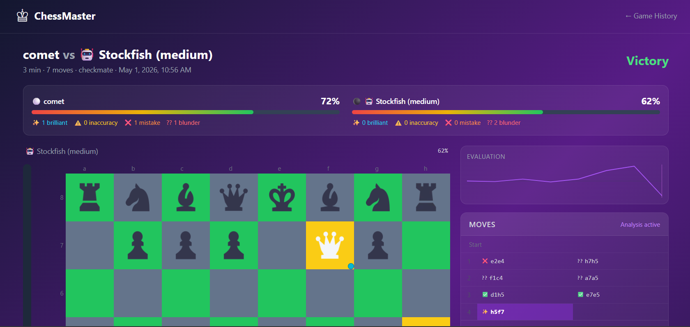
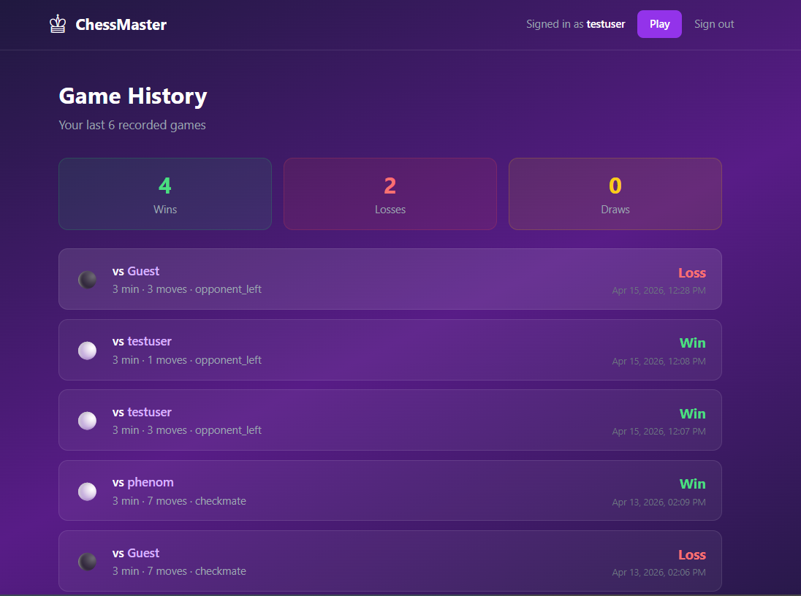
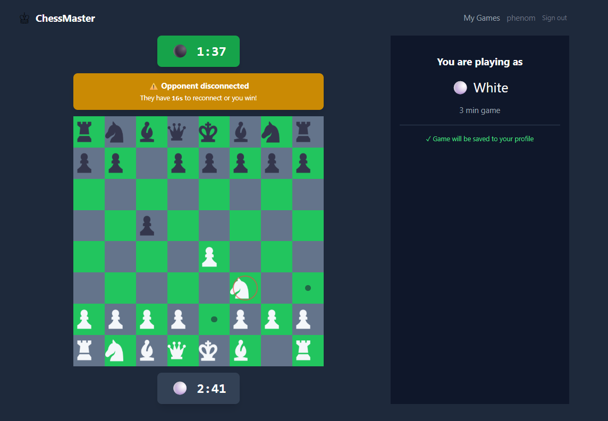

# Changelog
## Features
1. Play chess with a computer or with a friend online.
2. This app also features `Stockfish Game Anaysis`.
3. Games are saved in Redis until they're being played. 
4. Users and Games (after termination) are saved permanently in PostgreSQL.
5. App is written completely in TypeScript.
## Screenshot

## Contribution
(We welcome contributions! Please follow these steps to contribute to this project:)

### How to Contribute

1. **Fork the repository**
	- Click the "Fork" button at the top right of this page to create your own copy.

2. **Clone your fork**
	- `git clone https://github.com/your-username/Chess.git`
	- Replace `your-username` with your GitHub username.

3. **Create a new branch**
	- `git checkout -b feature/your-feature-name`

4. **Make your changes**
	- Add your feature or fix a bug. Please follow the existing code style.

5. **Test your changes**
	- Make sure all tests pass and your code works as expected.

6. **Commit and push**
	- `git add .`
	- `git commit -m "Add your message here"`
	- `git push origin feature/your-feature-name`

7. **Open a Pull Request**
	- Go to your fork on GitHub and click "Compare & pull request".
	- Describe your changes clearly and reference any related issues.

8. **Code Review**
	- Wait for a maintainer to review your PR. Make changes if requested.

9. **Merge**
	- Once approved, your PR will be merged.

### Guidelines
- Follow the existing code style and structure.
- Write clear commit messages.
- Add tests for new features or bug fixes.
- Update documentation if needed.

Thank you for contributing!
